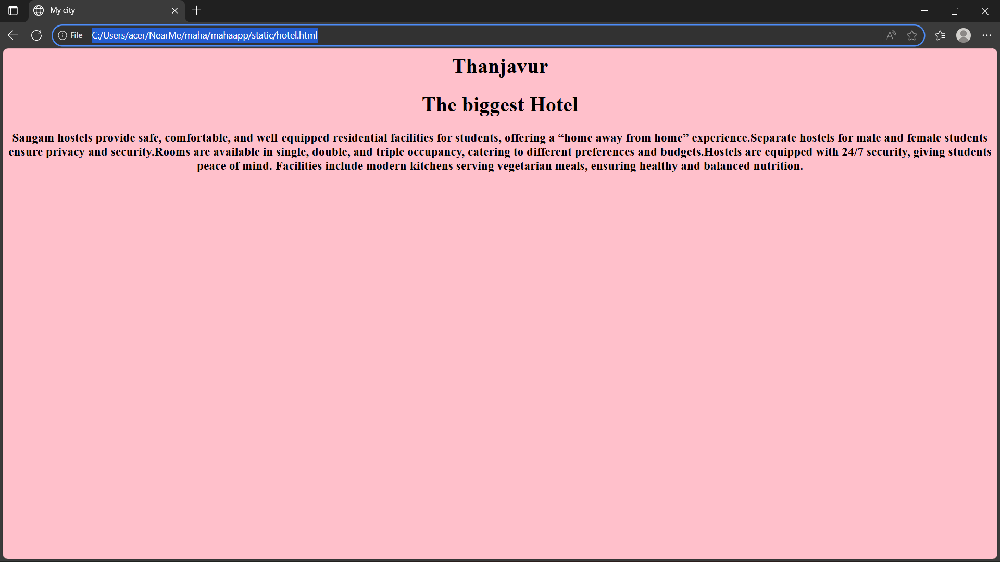
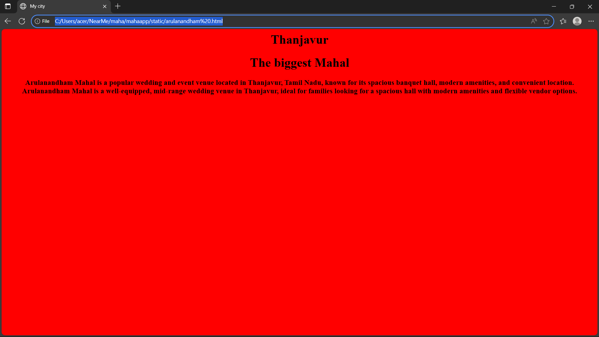
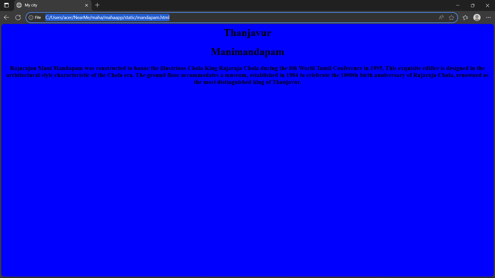
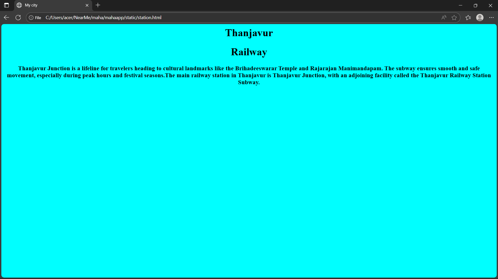
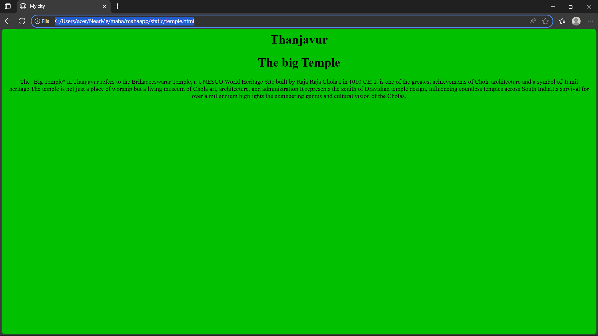

# Ex03 Places Around Me
## Date:1/12/2025 

## AIM
To develop a website to display details about the places around my house.

## DESIGN STEPS

### STEP 1
Create a Django admin interface.

### STEP 2
Download your city map from Google as an image.

### STEP 3
Insert the image using `````` tag and link it to the map.

### STEP 4
Using ```<map>``` tag name the map.

### STEP 5
Create clickable regions in the image using ```<area>``` tag.

### STEP 6
Write HTML programs for all the regions identified.

### STEP 7
Execute the programs and publish them.

## CODE

```

image.html
<html>
    <head>
        <title>My City</title>
    </head>
    <body>
        <h1 align="center">
            <font color="red"><b>Thanjavur</b></font>
        </h1>
        <h3 align="center">
            <font color="blue"><b>Mahalakshmi S (25018377)</b></font>
        </h3>
        <center>
            

<map name="image-map">
    <area target="" alt="Brihadeeswara" title="Brihadeeswara" href="temple.html" coords="928,219,678,299" shape="rect">
    <area target="" alt="mandapan" title="mandapan" href="mandapan.html" coords="802,485,720,539,717,617,893,614,890,546" shape="poly">
    <area target="" alt="hotel" title="hotel" href="hotel.html" coords="968,477,1124,533" shape="rect">
    <area target="" alt="railway station" title="railway station" href="station.html" coords="1047,362,69" shape="circle">
    <area target="" alt="mahal" title="mahal" href="arulanandham .html" coords="312,409,222,465,227,552,337,543,356,462" shape="poly">
</map>
        </center>
    </body>
</html>


manimandapan.htmlm

<html>
    <head>
        <title>My city</title>
    <body  align="center" bgcolor="blue">
        <h1 align="center">Thanjavur</h1>
     <h1>Manimandapan</h1>
     </body>
     Rajarajan Mani Mandapam was constructed to honor the illustrious Chola King Rajaraja Chola during the 8th World Tamil Conference in 1995. This exquisite edifice is designed in the architectural style characteristic of the Chola era. The ground floor accommodates a museum, established in 1984 to celebrate the 1000th birth anniversary of Rajaraja Chola, renowned as the most distinguished king of Thanjavur.
    </body>
</html>

arulanaandham.html

<html>
    <head>
        <title>My city</title>
    <body  align="center" bgcolor="red">
        <h1 align="center">Thanjavur</h1>
     <h1>The biggest Mahal</h1>
     <h3 align="black">
     Arulanandham Mahal is a popular wedding and event venue located in Thanjavur, Tamil Nadu, known for its spacious banquet hall, modern amenities, and convenient location.
        Arulanandham Mahal is a well-equipped, mid-range wedding venue in Thanjavur, ideal for families looking for a spacious hall with modern amenities and flexible vendor options.
     </h3>
    </body>
</html>


hostel.html


<html>
    <head>
        <title>My city</title>
    <body  align="center" bgcolor="pink">
        <h1 align="center">Thanjavur</h1>
     <h1>The biggest Hotel</h1>
     <h3>
         Sangam hostels provide safe, comfortable, and well-equipped residential facilities for students, offering a “home away from home” experience.Separate hostels for male and female students ensure privacy and security.Rooms are available in single, double, and triple occupancy, catering to different preferences and budgets.Hostels are equipped with 24/7 security, giving students peace of mind. Facilities include modern kitchens serving vegetarian meals, ensuring healthy and balanced nutrition.
     </h3>
     </body>
</html>


station.html


<html>
    <head>
        <title>My city</title>
    <body  align="center" bgcolor="cyan">
        <h1 align="center">Thanjavur</h1>
     <h1>Railway</h1>
     <h3>
        Thanjavur Junction is a lifeline for travelers heading to cultural landmarks like the Brihadeeswarar Temple and Rajarajan Manimandapam. The subway ensures smooth and safe movement, especially during peak hours and festival seasons.The main railway station in Thanjavur is Thanjavur Junction, with an adjoining facility called the Thanjavur Railway Station Subway.
     </h3>
    </body>
</html>


temple.html

<html>
    <head>
        <title>My city</title>
    <body  align="center" bgcolor="skycolor">
        <h1 align="center">Thanjavur</h1>
     <h1>The big Temple</h1>
     </h3>
     The "Big Temple" in Thanjavur refers to the Brihadeeswarar Temple, a UNESCO World Heritage Site built by Raja Raja Chola I in 1010 CE. It is one of the greatest achievements of Chola architecture and a symbol of Tamil heritage.The temple is not just a place of worship but a living museum of Chola art, architecture, and administration.It represents the zenith of Dravidian temple design, influencing countless temples across South India.Its survival for over a millennium highlights the engineering genius and cultural vision of the Cholas.
    </h3>
    </body>
</html>


```

## OUTPUT






.png>)

## RESULT
The program for implementing image maps using HTML is executed successfully.
